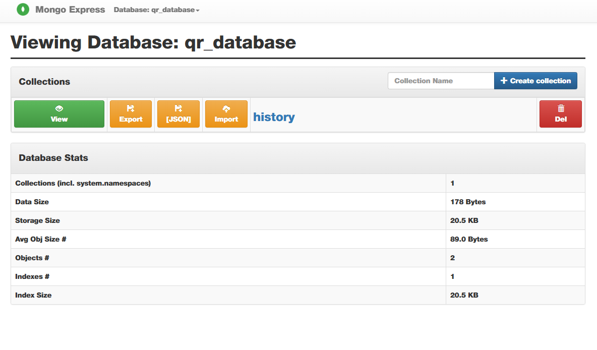

### TASK
```
Containerize a simple app (Node.js/Python/Java) that connects to a database (MySQL/PostgreSQL/MongoDB).

Run both app and DB in separate containers, using environment variables for configuration.

Use volumes to persist database data.

Ensure the app can read/write to the database locally.

Push the app image to Docker Hub.

Use docker-compose to run both containers together.
```

#### Setup

#### Prerequisites

- Create credential files for MongoDB authentication:
    - `user.txt` - MongoDB username
    - `pass.txt` - MongoDB password

- Add credentials to `.env` file:
    ```env
    MONGO_USERNAME=your_username
    MONGO_PASSWORD=your_password
    ```

- Add `.env` to `.gitignore` to prevent credential exposure

#### Configuration

- `docker-compose.yml` references secrets from environment variables
- `app.py` reads/writes QR code data to MongoDB
- Displays the top 5 most recent QR code entries

**Note:** Set username and password in `.env` before running containers.


#### Run

```powershell
docker-compose -f qr-compose.yaml up --build -d
```

#### App image

app image can be found [here](https://hub.docker.com/r/shoun6000/qr-generator)

#### Process

- First Created/Pulled mongo and mongo-express images from docker hub
- Created Docker file for python app 

```yaml
FROM python:3.9

WORKDIR /shoun

COPY requirements.txt /shoun/requirements.txt

RUN pip install --no-cache-dir --upgrade -r /shoun/requirements.txt

COPY app.py /shoun/app.py

EXPOSE 8501

CMD ["streamlit", "run", "app.py", "--server.port=8501", "--server.address=0.0.0.0"]
```
- Executed the containers under services:
- Executed the app as build . , the line builds the image and then executes the container

```cmd
docker-compose -f qr-compose.yaml up --build -d
```
```cmd
                                                  0.0s
 => resolving provenance for metadata file                                                                                                                                                                      0.0s
[+] Running 5/5
 ✔ qr-app                                       Built                                                                                   
                                                                        0.0s
 ✔ Volume "qr-code-generator_mongo-data"        Created                                                                                 
                                                                        0.0s
 ✔ Container qr-code-generator-mongodb-1        Started                                                                                 
                                                                        1.5s
 ✔ Container qr-code-generator-qr-app-1         Started                                                                                 
                                                                        1.4s
 ✔ Container qr-code-generator-mongo-express-1  Started                                                                                 
                                                                        0.3s
```


- Streamlit app running on [localhost:8501](http://localhost:8501/)


- Mongo express on qr database [localhost:8081](http://localhost:8081/db/qr_database/)



------------------------

- Data persistence enabled using **named volume** in the qr-compose.yaml

```yaml
volumes:
      - mongo-data:/data/db
```

- mongo db data storage location is mapped to mongo-data variable

```yaml
volumes:
  mongo-data:
    driver: local
```

- data is saved to local/host in the docker folder inside VM
```cmd
\\wsl.localhost\docker-desktop\mnt\docker-desktop-disk\data\docker\volumes\qr-code-generator_mongo-data
```


------------------------
- the image is send to docker hub using github actions CI workflow

```docker
name: Docker Image CI

on:
  workflow_dispatch: 

jobs:
  build-and-push:
    runs-on: ubuntu-latest

    steps:
      - name: Checkout code
        uses: actions/checkout@v4

      - name: Build Docker Image
        run: |
          docker build -t shoun6000/qr-generator:${{ github.run_number }} .
          docker tag shoun6000/qr-generator:${{ github.run_number }} shoun6000/qr-generator:latest

      - name: Push Docker Image
        run: |
          docker login -u ${{ secrets.DOCKER_USERNAME }} -p ${{ secrets.DOCKER_TOKEN }}
          docker push shoun6000/qr-generator:${{ github.run_number }}
          docker push shoun6000/qr-generator:latest
      
```

- The event is triggered on click from actions tab
````docker
DOCKER_USERNAME
DOCKER_TOKEN
````
- values are stored in repo setting under secrets & variables
- used to authenticate docker hub, [recent docker image workflow](https://github.com/sho6000/Qrcode-generator/actions/runs/21200609380/job/60985360039)


